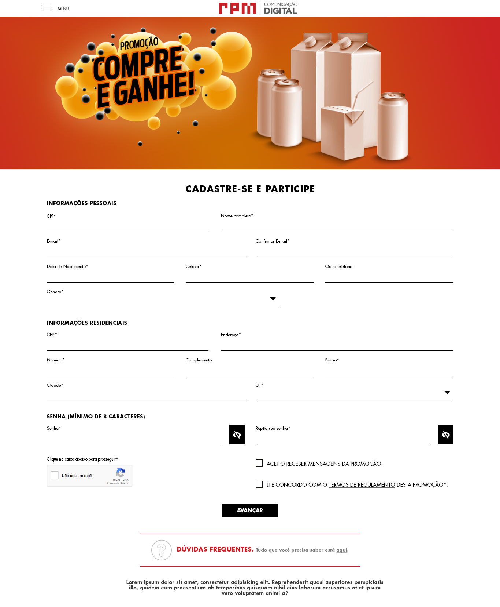

# Quero trabalhar na RPM

Então você chegou até aqui. Agora vamos avaliar o seu conhecimento técnico que com isso vamos conseguir entender melhor como você trabalha com versionamento, como você estrutura o seu código, então mostre o seu melhor.

## A missão:

Sua missão é criar a página abaixo:

### Requisitos:

1. Crie um repositório no GitHub ou no Bitbucket.
2. Utilizando a estrutura de pastas que você escolher monte o layout anexo.
3. Com o uso de Javascript ou JQuery, faça a validação de todos os inputs.
4. Crie um layout responsivo Mobile/Desktop usando o bootstrap ou outro de sua preferência.

### Devem ser utilizadas as seguintes tecnologias:
-	Bootstrap V3 / V4 
-	HTML / HTML5
-	Css / Css3 
-	Less / Sass
-	JavaScript
-	JQuery
- **Nos envie o seu repositório**

### Observações:

- Você pode utilizar um pre-processador se desejar.
- Os arquivos PSD está na pasta **public**